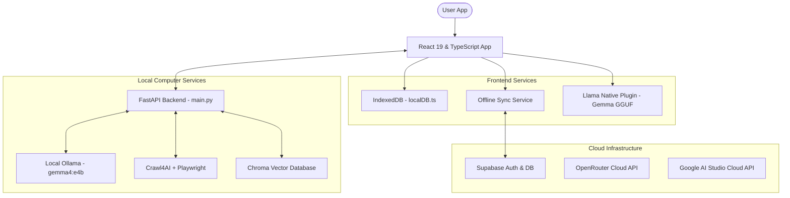

# Kalam Spark - Technical Architecture & Documentation

This document describes the technical architecture, design patterns, agentic workflows, and offline execution models used in **Kalam Spark**.

---

## 🗺️ 1. Architecture Overview

Kalam Spark is built as a **Local-First, Cloud-Synced** application. It functions across three platforms (Web Browser, Local Desktop/Laptop, and Native Mobile) while maintaining offline availability and data consistency.

---

## 🤖 2. Agentic Swarm Architecture

Instead of generic chat loops, the platform relies on specialized, autonomous agents that orchestrate data collection and reasoning:

### A. Career Architect Agent
* **Role**: Collects live career insights and formats structured 4-stage roadmaps.
* **Workflow**:
  1. Triggered when a student requests a roadmap.
  2. Autonomously scrapes career guides and skill frameworks using **Crawl4AI** and **Playwright**.
  3. Combines crawled content with user details (education, branch, city) to build the prompt.
  4. Calls the **Gemma 4** model to synthesize a structured JSON roadmap containing subjects, skills, durations, resources, and hands-on projects.
  5. Implements a **Cross-Disciplinary Pivot Guard** to identify transitions (e.g., Computer Science to Medical Doctor) and enforces transition stages (e.g., entrance exam prep, prerequisites) over standard career tracks.

### B. Mentor & Coach Agent
* **Role**: Context-aware technical assistant with local/cloud memory.
* **Workflow**:
  1. Maintains a FIFO-evicted history of conversation logs.
  2. Detects the student's language (supports English and 8 major Indian languages).
  3. Incorporates the student's active roadmap stage as a system prompt to align conversation topics.
  4. Connects to the local quantized model on mobile or cloud API to generate responses.

### C. Document Intelligence Agent (File Speaker)
* **Role**: Ingests files (PDF, DOCX, TXT, MD) and URLs to generate key concepts, summaries, flashcards, or custom audio podcasts.
* **Workflow**:
  1. Extracts text from user uploads.
  2. Embeds document chunks using `text-embedding-004` and stores them in a local **Chroma** vector database.
  3. Uses RAG (Retrieval-Augmented Generation) to answer user queries with precise document context.
  4. Generates a multi-host, interactive podcast script in the detected document language.
  5. Narration is generated using **edge-tts** with regional accents.

### D. Opportunity Radar Agent
* **Role**: Matches real-world opportunities to active learning milestones.
* **Workflow**:
  1. Scans the active stage subjects and user skills.
  2. Evaluates suitable role profiles and maps realistic internship or hackathon objectives.

---

## ⚡ 3. 3-Tier Multi-LLM Failover Routing

To guarantee continuous availability online and offline, the backend executes a failover hierarchy when calling the LLM:

1. **Tier 1 (Primary Cloud - OpenRouter)**: Requests the cloud-hosted `google/gemma-2-27b-it` or similar model.
2. **Tier 2 (Secondary Cloud - Google AI Studio)**: Falls back to Gemini/Gemma models via the developer's API keys if OpenRouter is unreachable or rate-limited.
3. **Tier 3 (Local Fallback - Ollama)**: Falls back to a local Ollama daemon (`gemma4:e4b`) running on `http://localhost:11434` if all cloud API keys are absent or failed.

---

## 📱 4. Mobile Offline Execution Model

When compiled for native mobile platforms (Android/iOS) via **Capacitor**, the app runs completely standalone:

* **Native Model Execution**: The app leverages a custom native plugin (`LlamaPlugin.java`/`LlamaPlugin.swift`) written in JNI (Java Native Interface) and Swift.
* **Quantized Model Loading**: The user copies a quantized Gemma model (e.g. `google_gemma-4-E2B-it-Q2_K.gguf`) into their Downloads folder. The native plugin loads the model directly into application memory.
* **Zero Network Calls**: All AI Mentor chats, task suggestions, and onboarding summaries are handled directly by the JNI plugin on the phone, meaning no backend server or internet connection is required.

---

## 💾 5. Local-First Database & Synchronization

Kalam Spark uses a local-first architecture to protect user progress and study data.

* **IndexedDB Store (`localDB.ts`)**: All user profiles, roadmaps, task lists, and completed stages are stored locally in the browser/app database.
* **Supabase Synced**: When online, the `OfflineSyncService` enqueues and flushes operations to Supabase in the background, updating PostgreSQL tables (`users`, `tasks`, `roadmaps`, `completed_stages`).
* **Conflict Resolution**: Timestamps (`_updatedAt`) are appended to all local records. When syncing, the latest updated timestamp wins.
* **Spaced Repetition Engine**: Integrates **FSRS v5** (Free Spaced Repetition Scheduler) and **Ebisu** algorithms to track memory retention levels for studied concepts, scheduling revision micro-quizzes at optimal intervals to prevent information decay.
